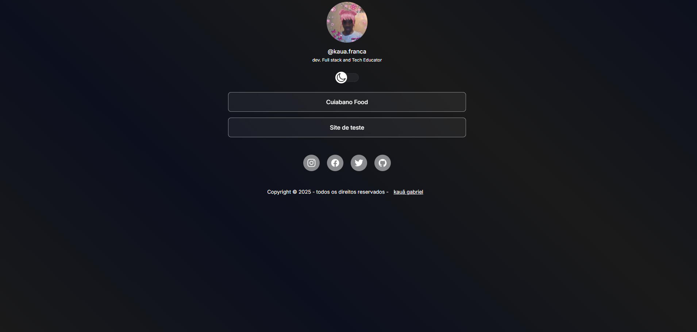

<h1 align="center"> PERFIL DE CONTATO </h1>

<br>

<div align="center">
  <a href="#-projeto">👨‍💻 Projeto</a>&nbsp;&nbsp;&nbsp;|&nbsp;&nbsp;&nbsp;
  <a href="#-tecnologias">🚀 Tecnologias</a>&nbsp;&nbsp;&nbsp;|&nbsp;&nbsp;&nbsp;
  <a href="#-funcionalidades">💻 Funcionalidades</a>&nbsp;&nbsp;&nbsp;|&nbsp;&nbsp;&nbsp;
  <a href="#-prévia-do-projeto">📷 Prévia do Projeto</a>&nbsp;&nbsp;&nbsp;|&nbsp;&nbsp;&nbsp;
  <a href="#-executar-aplicação">🔥 Executar Aplicação</a>&nbsp;&nbsp;&nbsp;|&nbsp;&nbsp;&nbsp;
  <a href="#-melhorias-futuras">📌 Melhorias Futuras</a>&nbsp;&nbsp;&nbsp;|&nbsp;&nbsp;&nbsp;
  <a href="#-licença">📄 Licença</a>&nbsp;&nbsp;&nbsp;|&nbsp;&nbsp;&nbsp;
  <a href="#-autor">👨‍💻 Autor</a>&nbsp;&nbsp;&nbsp;|&nbsp;&nbsp;&nbsp;
</div>

<br>

<div align="center">
  
  
  
</div>

<br>

## 👨‍💻 Projeto

Perfil de Contato é um projeto criado para guardar e organizar seus projetos pessoais ou profissionais em um só lugar. Ele funciona como uma espécie de “portfólio pessoal”, onde você pode salvar tudo o que já fez — como trabalhos, ideias, arquivos ou links — e manter isso registrado de forma prática e acessível.

A ideia é que você tenha sempre à mão um espaço só seu, onde pode reunir seus projetos, acompanhar sua evolução e, se quiser, até mostrar para outras pessoas. É uma forma simples de manter tudo salvo, sem bagunça, e nunca mais perder o que você criou.


<br>

## 💡 Sobre o Projeto
Este projeto, chamado Perfil de Contato, foi criado para ajudar você a guardar, organizar e acessar seus projetos de forma simples e eficiente. Com ele, é possível registrar seus trabalhos pessoais ou profissionais, salvar ideias, arquivos e links importantes, e manter tudo reunido em um só lugar. A proposta é oferecer um espaço seguro e prático onde você possa acompanhar sua trajetória e ter seus projetos sempre à mão, prontos para serem consultados ou compartilhados quando quiser.

Acessar Site Perfil de Contato **[Clique aqui](https://kaua-gabriel-franca.github.io/perfil-contato/)**

<br>

## 🚀 Tecnologias

<div align="center">
  
  
  
  
  
</div>  
 
<br>

- **HTML5** → Estruturação do projeto
- **CSS3** → Estilização e responsividade
- **JavaScript e jQuery** → Funcionalidades interativas
- **Google Fonts** → Distribui fontes gratuitas.
- **Ionsicons** → Fornece ícones prontos para usar.


<br>

## 🧩💻 Funcionalidades

✅ **Design responsivo** para diferentes dispositivos 📱💻  
✅ **Animações suaves** ao rolar a página ✨  
✅ **Interface moderna e intuitiva** 🎨  
✅ **Código organizado e escalável** 🔧  
✅ **Otimizado para performance e carregamento rápido** 🚀

<br>

## 📷 Prévia do Projeto



<br>

## 🔥 Executar Aplicação

### 🎇 Executando Localmente a Aplicação

Caso você deseja executar o projeto na sua máquina local, você precisará clonar o projeto, para isso, basta seguir os passos abaixo:

### 🌀 Clonar o repositório

Para começar, você deve simplesmente clonar o repositório do projeto na sua máquina.

Navegue até o local onde você clonou o projeto, exemplo:

```sh
C:\Users\NomeDoComputador\Documents\CloneDoProjeto
```

<br>

### 🛰️ Executando o projeto

Para executar sugiro que abra o projeto com o Visual Studio Code (VSCode).
Se estiver usando o VSCode é só instalar a extensão Live Server.
Agora é só executar o arquivo index.html com a extensão Live Server, clique com botão esquerdo do mouse sobre o index.html e selecione a opção **Open with Live Server**.

Pronto! dessa forma o projeto `Perfil de contato` estará rodando localmente em sua maquina. Acesse no navegador o endereço abaixo:

```
http://127.0.0.1:5500/index.html
```

<br>

## 🚩 Tenho Dúvidas... O que fazer?

Caso tenha dúvidas sobre o código do projeto, sintam-se a vontade em abrir uma **[ISSUE AQUI](https://github.com/kaua-gabriel-franca/perfil-contato/issues)**. Assim que possível, responderei todas as dúvidas!

<br>

## 📌 Melhorias Futuras

- Organizar melhor meus projetos.
- Atualizar meus conteúdos com frequência.
- Melhorar a apresentação visual do perfil.

<br>

## 📄 Licença

<p>Este projeto é de código aberto e pode ser utilizado para estudos e aprimoramento. 📜</p>

Para mais detalhes sobre a licença: [clique aqui](.github/LICENSE)

<br>

## Autor

<div align="center"> 

<br>

💡 **Desenvolvido por [Kauã Gabriel](https://github.com/kaua-gabriel-franca)** </div>
